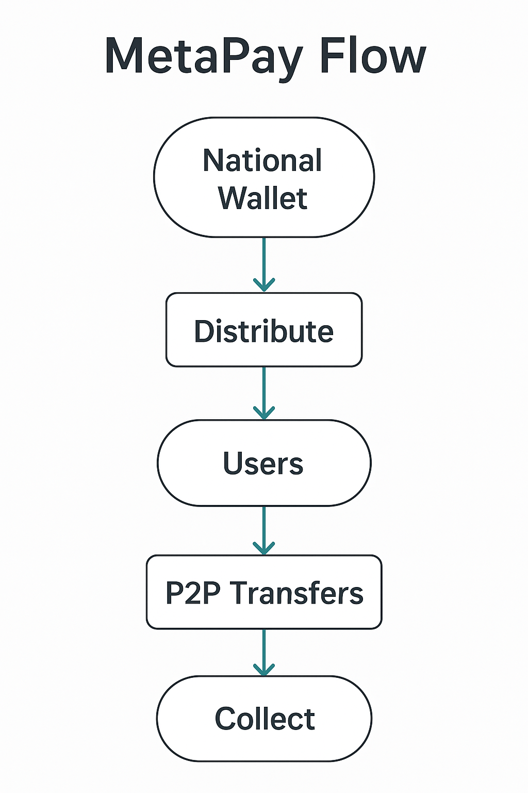

⚠️ **License Notice**  
This project is protected by copyright. Unauthorized use is strictly prohibited.  
Contact: anioia33@gmail.com

# MetaPayP2P – Web3 Basic Income Simulation with Peer Transfers

🧭 *"Freedom through basic income — made sustainable via smart contracts and AI."*

A circulating basic income simulation with blockchain distribution, AI behavior monitoring, and real-time peer transfers.

---

## 🌍 Why This Matters

**MetaPayP2P** demonstrates a sustainable, self-circulating basic income model —  
one that doesn’t rely on unlimited government funding or taxation.  
By combining immutable blockchain distribution with non-intrusive AI monitoring,  
MetaPay enables digital economic freedom and scalable public benefit.

---

## 🧪 Simulation Structure

- **Total: 15 rounds**
  - 10 rounds of national wallet distribution
  - 5 rounds of collection + redistribution
  - Full cycle ≈ 30 minutes (accelerated for testing)

⏱️ **Time-Compressed Simulation**

- 2 minutes simulate 1 month.
- Every 2 minutes, the national wallet distributes 500 units to 10 users.
- After each distribution, P2P transfers are allowed for 1 minute, starting 30 seconds after funds are received.
- Data is then collected, and the next round begins.
- After 10 distributions, 5 rounds of collection + redistribution follow.

---

## 📱 Test DApp Details

- A separate frontend DApp is provided for each of the 10 test users.
- You will receive a Sepolia wallet address and DApp link to participate.
- MetaMask must be connected to the Sepolia testnet.
- You must initiate at least one P2P transfer within the allowed time per round.

### 📌 Requirements

- Sepolia testnet ETH is required to cover gas fees.
- Only developers or active Web3 users may apply. Not open to general users.

### 🧾 Upon Participation

You will receive:
- Your wallet address and seed phrase (for simulation only)
- A list of 10 citizen test wallet addresses
- Access to the simulation DApp

### 📨 To apply for test participation:
Send an email to **anioia33@gmail.com** with the subject:

```
MetaPayP2P Test Application
```

Include:
- Your Ethereum wallet address  
- Your Web3 experience level  
- Your interest in basic income systems

---

## 🔁 Circulation Logic of MetaPay



---

## 🤖 AI Analyze (Experimental)

This simulation includes an experimental AI module that analyzes P2P transactions.

### 🔧 How to Use AI

```bash
cd ai-server
node server.js
```

### 📊 Example Output

- User1 frequently sends to User3 – possible payroll pattern.  
- User5 is inactive over 5 rounds – dormant wallet.  
- User7 only receives and never sends – potential accumulation.

⚠️ *Disclaimer:* This AI analysis module is experimental.  
Results may vary based on input data and user behavior patterns.  
No financial or behavioral decisions should rely solely on this module.

---

## 🧠 Role of AI in MetaPay

MetaPay ensures immutable monthly distribution and automatic collection to guarantee fairness and sustainability.  
The AI module only analyzes peer-to-peer (P2P) transactions, offering **risk alerts** and **optimization suggestions**.

✅ **AI Capabilities:**
- Detects abnormal behaviors (e.g., always sending or never sending)
- Flags dormant wallets
- Suggests optimized transfer logic (e.g., corporate salaries, vendor payments)
- Never controls or interrupts the base circulation logic

🔒 AI never interferes with the national wallet’s fund flow.  
It supports user behavior transparency — not control.

This structure ensures AI is used ethically and effectively, supporting financial autonomy.

---

## 📎 Project Links

- 🌐 **DApp**: https://meta-pay-p2-p.vercel.app  
- 🧠 **Forum Post**: [MetaPay Thread on CEG Forum](https://forum.ceg.vote/t/metapay-a-circulating-basic-income-model-with-digital-currency/5537/34)  
- 🐙 **GitHub**: https://github.com/metapay-creator/MetaPayP2P  
- 🐦 **X (Twitter)**: https://x.com/metapay_creator  
- 🔗 **Smart Contract (Sepolia)**: `0xB5912A07Cd6396E1BAE87aCB8EB04B74A1fABCbD`  
- 🎥 **Demo Video**: [YouTube – Vibe Session Demo](https://youtu.be/zHxQI9oil-0)

---

## 🧰 Tech Stack

- `Solidity` smart contract on **Sepolia Testnet**
- `React + Vite` frontend with MetaMask integration
- `Ethers.js` for Web3 interaction
- JS-based AI behavior simulator (**Alith-inspired**)

---

## 🛠️ Local Development (Optional)

```bash
git clone https://github.com/metapay-creator/MetaPayP2P
cd MetaPayP2P
npm install
npm run dev
```

### 📂 Project Structure

```
MetaPayP2P/
├── public/
│   ├── ai-banner.png
│   ├── ai-risk-analysis.png
│   └── metapay-circulation.png
├── src/
│   ├── App.jsx
│   └── abi.js
├── ai-server/
│   └── server.js
├── README.md
```

---

## 📊 Summary Table

| Feature              | Description                                         |
|----------------------|-----------------------------------------------------|
| National Distribution| 500 tokens every 2 mins to 10 users (simulated)     |
| P2P Transfers        | 1 min transfer window after each distribution       |
| AI Module            | Behavior analysis, dormant detection, suggestions   |
| Smart Contract       | Sepolia testnet (address provided)                  |

---

## 📦 Version

- **v1.0.0** – Initial testnet launch with AI-P2P integration

---

## ⚖ License

MIT License  
© 2025 Gyuha Yoon – MetaPay Project for HyperHack
